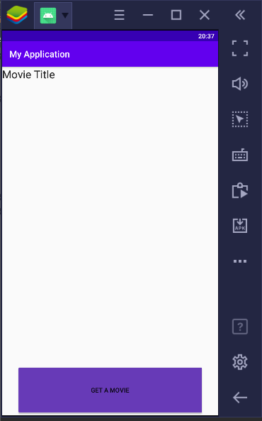
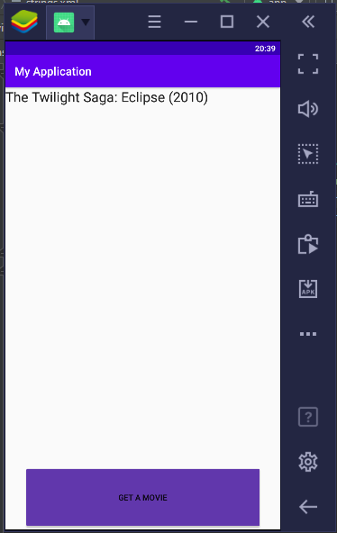
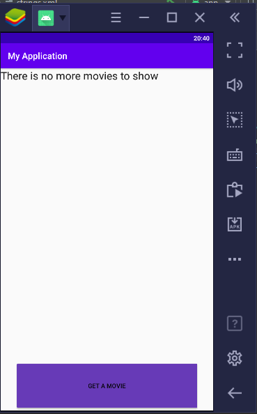

# simple-movie-app

## Данное простое приложение хранит список фильмов в XML-файле strings.xml ( https://developer.android.com/guide/topics/resources/string-resource.html )

По нажатию на кнопку в текстовое поле выводится случайный фильм из имеющихся. Фильмы не должны повторяться, если фильмов больше нет - сообщить об этом. Можно предусмотреть кнопку "Сброс" для показа фильмов сначала.

В качестве ответа приложите:

1) Файлы с кодом (java, XML)

2) Скриншоты экрана (сделайте на устройстве или эмуляторе)

Не нужно прикладывать архив с проектом целиком.
